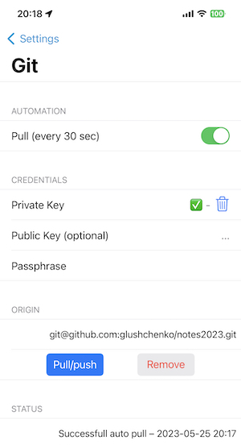
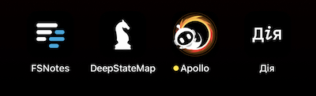
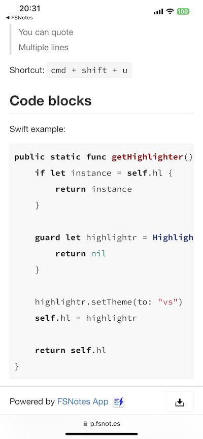

# Meet FSNotes 6!

## New design

The biggest design change in the history of the program. The new FSNotes adheres even more to Apple's human interface guidelines. Branded icons, menus, toolbars, headers, animations and smooth transitions. Everything has become closer to the familiar Apple system programs.

I want to give a huge thanks to my friend Dylan Seeger for his valuable advice. Thanks to his ticketing, you see this update like this.

## Versioning with git

The last version added versioning, but I didn't think it was enough. Therefore, meet git! If you are a programmer, you probably know what it is, but if you don't, you can learn about it here: https://en.wikipedia.org/wiki/Git.

You can create a git repository for each folder and commit your notes and send the changes to your server.

Changes are pulled up when the app activates and you can also set it to do it every 30 seconds automatically.

## Application icons

The old icon by Roman Kliuchkovych was beautiful, but time is of the essence, for the sixth version the new icon was drawn by Dylan Seeger. You can find his website in the settings!

I often use the main wallpaper color black, so there is also an all-black version. Mine is set to look like this:

## Improvements in the editor

Even more actions are available directly within the editor, thanks to the new toolbar you can now quickly create a new note or go to search on the main screen.

## Web sharing

The note will open in your browser and the link will be copied to your clipboard. So far there is no heavy load and I have not deleted the notes, but over time I think they will be temporary, with a shelf life of 1 month.

## Fixes

New bugs may have been added, of course.

-- Oleksandr, Kharkiv, Ukraine
